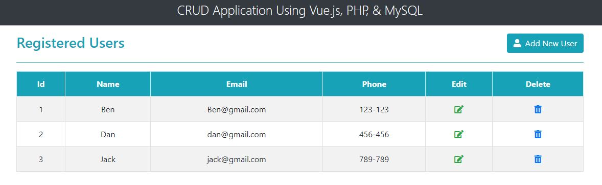
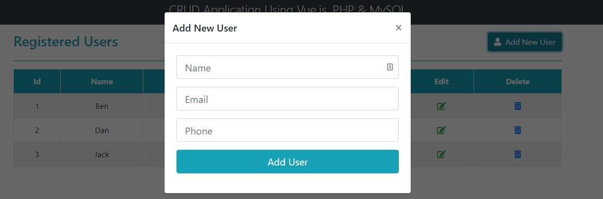

# Vue_PHP_MySql

By creating this project I wanted to try out implementing a simple dashboard using Vue as a front-end and PHP as a back-end.  
I've followed a tutorial on Youtube.

# Project
Manage users through dashboard.  
It shows users and allows to Add, Remove and Edit each one of them.  

# Structure
There are 3 files in the repository:

1.  <ins>index.html </ins>  
Generates the html code.  

2. <ins>main.js </ins> 
Vue app which manages the state of the application, sends requests to API endpoints 
and adds functionality to the interface.  

3.  <ins> process.js </ins>  
API endpoint for handling all the interactions with the database.  
There are 4 endpoints - Read / Create / update / Delete.

   

  

